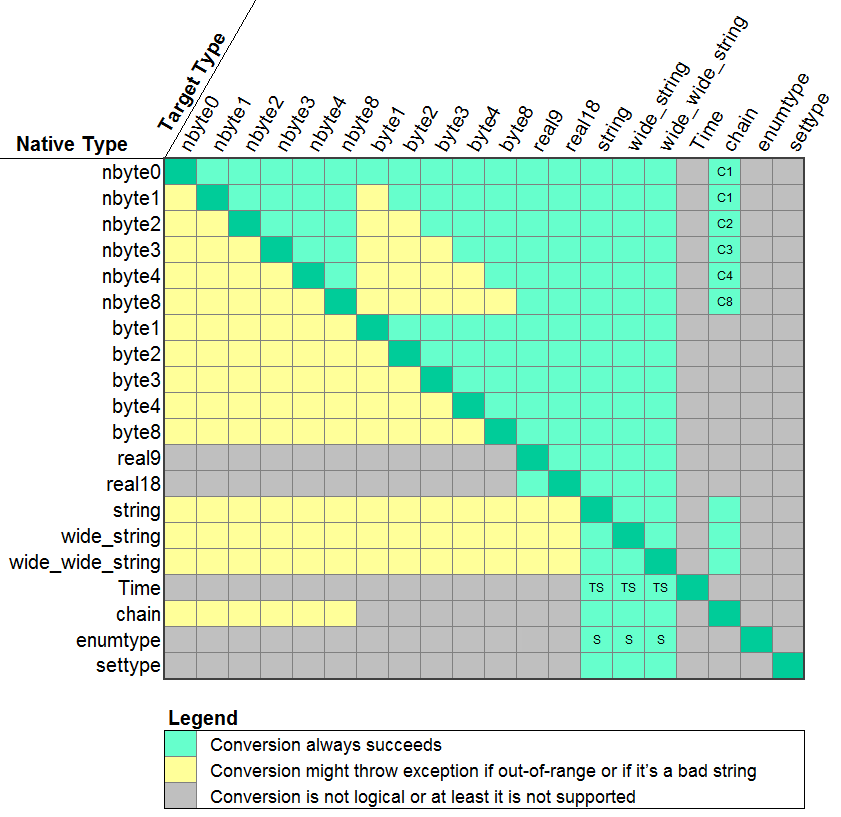

<pre class="code">
package AdaBase is
   type field_types is (ft_nbyte0, ft_nbyte1, ft_nbyte2, ft_nbyte3, ft_nbyte4,
                        ft_nbyte8, ft_byte1, ft_byte2, ft_byte3, ft_byte4,
                        ft_byte8, ft_real9, ft_real18, ft_textual,
                        ft_widetext, ft_supertext, ft_timestamp,
                        ft_chain, ft_enumtype, ft_settype);
end AdaBase;

package AdaBase.Results is

   -------------------------------------------
   --  Supported Field Types (Standardized) --
   -------------------------------------------

   subtype NByte0 is Boolean;
   type NByte1 is mod 2 ** 8;
   type NByte2 is mod 2 ** 16;
   type NByte3 is mod 2 ** 24;
   type NByte4 is mod 2 ** 32;
   type NByte8 is mod 2 ** 64;
   type Byte8  is range -2 ** 63 .. 2 ** 63 - 1;
   type Byte4  is range -2 ** 31 .. 2 ** 31 - 1;
   type Byte3  is range -2 ** 23 .. 2 ** 23 - 1;
   type Byte2  is range -2 ** 15 .. 2 ** 15 - 1;
   type Byte1  is range -2 **  7 .. 2 **  7 - 1;
   type Real9  is digits 9;
   type Real18 is digits 18;

   --  Also #14 String 
   --  Also #15 Wide_String
   --  Also #16 Wide_Wide_String
   --  Also #17 Time (from Ada.Calendar)

   --  #18 chain
   type Chain is array (Positive range <>) of NByte1;

   --  #19 enumeration type
   type Enumtype is record enumeration : Textual; end record;

   --  #20 set type (array of enumerations)
   type Settype is array (Positive range <>) of Enumtype;

end AdaBase.Results;

package AdaBase.Results.Field is
   type Std_Field is tagged private;
end AdaBase.Results.Field;
</pre>

There are currently 20 distinct types in AdaBase.  The native types from each
database are converted to one of these.  There are 10 integer types (5 sizes
with signed and unsigned flavors), a Boolean type (which can easily be
converted to an integer), two real types which correspond to floating point
and double floats, three string types, a Time type, an enumeration type, a set
type (which is an array of enumerations), and finally a "chain" type which is
an indefinite array of single bytes.  This is the type a Binary Large Object
(BLOB) would use.  Small chains (8 or less) can be converted to unsigned
integer types.  The conversion is sensitive to the Endian setting of the host
machine.

<h3>Type AdaBase.Results.Std_Field</h3>

The Std_Field object holds the result in its format type, and also allows
conversions to other types.  There are currently 20 data types, and the result
often can be retrieved as multiple types.  The "is_null" function will
indicate if the value is marked as "null" in the database and the
"native_type" function will return a member of the "field_types" type to
indicate the data type stored in the database.

<pre class="code">
package AdaBase.Results.Field is

   type Std_Field is tagged private;

   function as_nbyte0   (field : Std_Field) return NByte0;
   function as_nbyte1   (field : Std_Field) return NByte1;
   function as_nbyte2   (field : Std_Field) return NByte2;
   function as_nbyte3   (field : Std_Field) return NByte3;
   function as_nbyte4   (field : Std_Field) return NByte4;
   function as_nbyte8   (field : Std_Field) return NByte8;

   function as_byte1    (field : Std_Field) return Byte1;
   function as_byte2    (field : Std_Field) return Byte2;
   function as_byte3    (field : Std_Field) return Byte3;
   function as_byte4    (field : Std_Field) return Byte4;
   function as_byte8    (field : Std_Field) return Byte8;

   function as_real9    (field : Std_Field) return Real9;
   function as_real18   (field : Std_Field) return Real18;

   function as_string   (field : Std_Field) return String;
   function as_wstring  (field : Std_Field) return Wide_String;
   function as_wwstring (field : Std_Field) return Wide_Wide_String;

   function as_time     (field : Std_Field) return AC.Time;
   function as_chain    (field : Std_Field) return Chain;
   function as_enumtype (field : Std_Field) return Enumtype;
   function as_settype  (field : Std_Field) return Settype;

   function is_null     (field : Std_Field) return Boolean;
   function native_type (field : Std_Field) return field_types;

end AdaBase.Results.Field;
</pre>
 
<h3>Convertibility</h3>

The matrix below shows the possibilities for converting the native type into a
different type.  The gray blocks indicate conversion is not logical or at least
implemented, the green blocks indicate that the conversion is guaranteed to
succeed, and the yellow blocks indicate conversion can succeed, but it can also
raise an exception.  The most common reason for a conversion failure is
attempting an illegal range (e.g. converting a negative number into a natural
integer) or trying to convert a non-numerical string into a number.

 

 

An enumerated type can be converted into a string type.  The
Time type can only be converted to a string, and this has the form of the
ISO 8601 format (no timezone information).  Similarly, the natural types can
be converted into a array of bytes (aka "chain") up to 8 bytes.  A string
type can be converted into any other type, although attempting to convert
a one into a Time type may result in an FAILED_CONVERSION exception.

See {{ page.fetch_next }} and {{ page.res_spawn_field }}
for usage examples.

  <h3>See Also</h3>
  <ul>
    <li>{{ page.res_column }}</li>
    <li>{{ page.res_count }}</li>
  </ul>

